# VeggieNosh
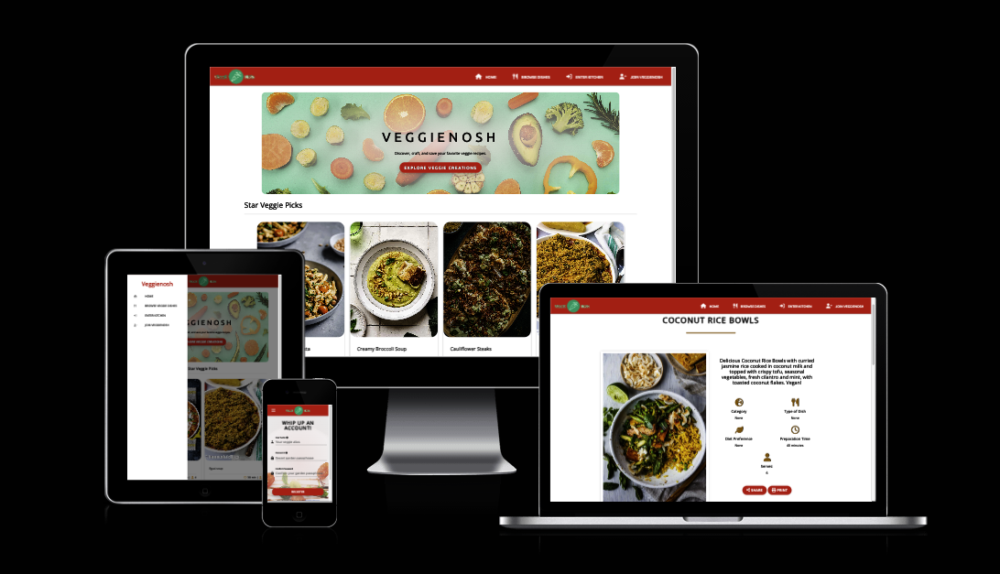
Find the final project here: [VeggieNosh]()

# Table of Contents
- [Introduction](#introduction)
- [UX](#ux)
   * [User Stories](#user-stories)
- [Design](#design)
  * [Technical Framework](#technical-framework)
  * [Colour Scheme](#colour-scheme)
  * [Typography](#typography)
  * [Imagery](#imagery)
  * [Database structure](#database-structure)
  * [Wireframes](#wireframes)
  * [Features](#features)
    * [The Home Page](#the-home-page)
    * [The Navigation Bar Functionality](#the-navigation-bar-functionality)
    * [The All Recipe Page](#the-all-recipe-page)
    * [The Single Recipe Page](#the-single-recipe-page)
    * [The Registration Page](#the-registration-page)
    * [The Login Page](#the-login-page)
    * [The Logout Page](#the-logout-page)
    * [The Account Settings Page](#the-account-settings-page)
    * [The Change Username Page](#the-change-username-page)
    * [The Change Password Page](#the-change-password-page)
    * [The Delete Account Page](#the-single-recipe-page)
    * [The User Recipe Page(My Recipe Page)](#the-user-recipe-page)
    * [The Add Recipe Page](#the-add-recipe-page)
    * [The Edit Recipe Page](#the-edit-recipe-page)
    * [The Delete Recipe Page](#the-delete-recipe-page)
    * [The Search Page](#the-search-page)
    * [The 404 and 500 Error Page](#the-404-and-500-error-page)
    * [Features to Implement in the Future](#features-to-implement-in-the-future)
  * [Accessibility](#accessibility)  
- [Issues and Bugs](#issues-and-bugs)
- [Technologies Used](#technologies-used)
  * [Main Languages Used](#main-languages-used)
  * [Frameworks, Libraries & Programs Used](#frameworks-libraries--programs-used)
- [Testing](#testing)
  * [TESTING.md](#TESTING.md)
- [Deployment](#deployment)
  * [Deployment To Heroku](#deployment-to-heroku)
  * [How To Use This Project](#how-to-use-this-project)
- [Credits](#credits)
  * [Content](#content)
  * [Media](#media)
  * [Code](#code)
- [Acknowledgements](#acknowledgements)

# Introduction

### VeggieNosh: A Vegan Recipe-Sharing Platform

**Dedicated to the vibrant world of vegan cuisine**, VeggieNosh is a modern recipe-sharing platform inspired by esteemed websites such as [Vegan Recipe Club](https://veganrecipeclub.org.uk) and [Rainbow Plant Life](https://www.rainbowplantlife.com). The platform offers a **user-friendly interface** for crafting, sharing, and archiving beloved vegan recipes.

> _This project is a key part of the [Code Institute's Milestone Project 3](https://codeinstitute.net), contributing to the Diploma in Full Stack Software Development. It showcases a proficient implementation of **HTML, CSS, JavaScript, Python+Flask, MongoDB**, and other technologies. VeggieNosh fulfills the essential criteria for **CRUD operations**, allowing users to create, read, update, and delete recipes with ease._

# User Experience
### User Stories

#### New/Unregistered User
- Search for recipes easily.
- Explore all site recipes.
- View complete recipes of interest.
- Intuitive navigation with clear Sign-Up.
- Understand the site's purpose and functionality.

#### Returning/Registered User:
- Quick access to Log In.
- View latest recipes.
- Access account settings, personal cookbook, and other user-specific pages.
- Manage profile and recipes (create, edit, delete).
- Share recipes on social media.
- Print recipes.
- Access a contact page for queries.

#### Administrative User:
- All functionalities of a registered user.
- Manage my veggie recipes.
- Edit or delete any site recipes.

<details>
  <summary>Click to see Persona Forms!</summary>
  
  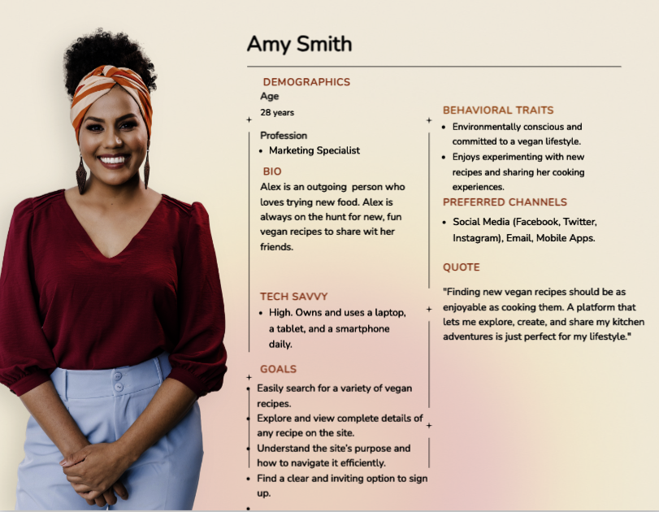
  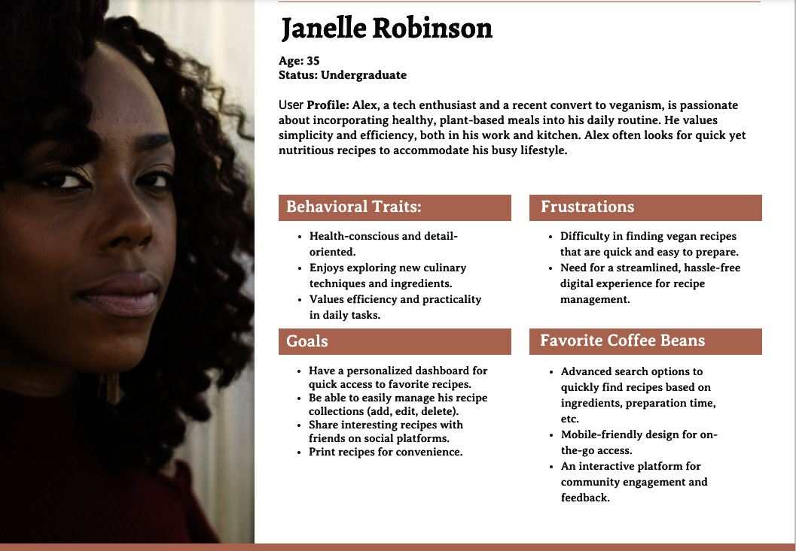
</details>

# Design
VeggieNosh is designed to harmoniously blend user convenience with modern design principles. This online vegan cookbook exemplifies a commitment to creating an interface that is both visually appealing and easy to navigate. It's a platform where recipes are elegantly and clearly showcased.
The following design elements were used in the website:

- ## Technical Framework
The [Materialize](https://materializecss.com/) front-end framework, inspired by Material Design, was the choice for VeggieNosh, bringing a fresh, responsive feel to the table. Together with [JQuery](https://jquery.com/), it lays down the interactive groundwork that makes the navigation and presentation of recipes intuitive and fluid.

- ## Colour Scheme
VeggieNosh embraces a color scheme that draws eyes to the vibrant dishes. A backdrop of white space ensures that the rich colors of the food images pop, complemented by touches of green that echo the essence of fresh, vegan ingredients. The addition of coral energizes and directs users through calls to action, creating an inviting, dynamic experience without overwhelming the visual senses.

Core colors:
- coral (#ff4242): Selected for its lively and inviting quality, encouraging user interaction.
- lightblack (#2e2e2e): Ensures text is readable against the light background.
- mediumwhite (#fffafa) and white (#ffffff): Provide a clean and contemporary canvas for the content.
For account settings, a trio of colors was selected to intuitively guide users through their options:

- Red: For actions that require caution or are irreversible.
- Yellow: For moments where caution is advised or to signal a change.
- Green: For positive actions, confirming correct selections or completion.


## Colour Palette
Using the [Adobe Color](https://color.adobe.com/create/color-wheel) colour wheel

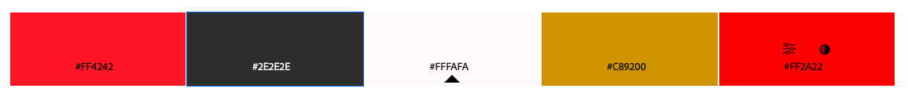

- ## Typography

• The choice of Open Sans as the primary font is deliberate, offering readability and a contemporary ambience, while Ubuntu lends a distinct personality to headings and buttons, enhancing the overall design language.

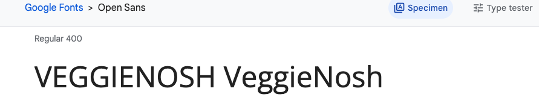


- ## Imagery
VeggieNosh website primarily relies on a text-based interface to create a distraction-free quiz environment. However, some key images and icons are used:
  * Logo: The VeggieNosh logo originated from [Hatchful](https://www.shopify.com/tools/logo-maker) and was later refined to enhance contrast, ensuring clear visibility across various platforms and display sizes. The final design showcases a stylized carrot set against a teal backdrop, with playful typography that echoes the vegan essence of the cookbook. This emblem is tailored to stand out and embody the freshness of the plant-based recipes featured on the site.

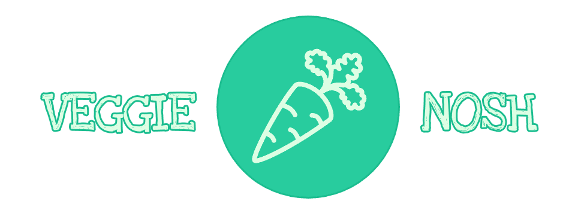

  * Icons: To enhance user engagement and facilitate content discovery, icons have been integrated extensively throughout VeggieNosh. Their use not only captures attention but also aids in content navigation and scanning. Icons serve as intuitive visual cues that transcend linguistic limitations, offering a more inclusive experience for non-native English speakers.

[Font Awesome](https://fontawesome.com/) is the primary source for the icons within the project, providing consistent and recognizable visuals for navigation bars, footers, forms, and recipe detail pages. In certain instances, [Materialize icons](https://materializecss.com/icons.html) have also been employed to complement the design.


  * [Favicon](https://www.favicon.cc/): A unique favicon is provided that is representative of the brand identity. It's visible in the browser tab for easy site identification.

- ## Database Structure
Database schema was designed using [diagram.io.](https://dbdiagram.io/home)

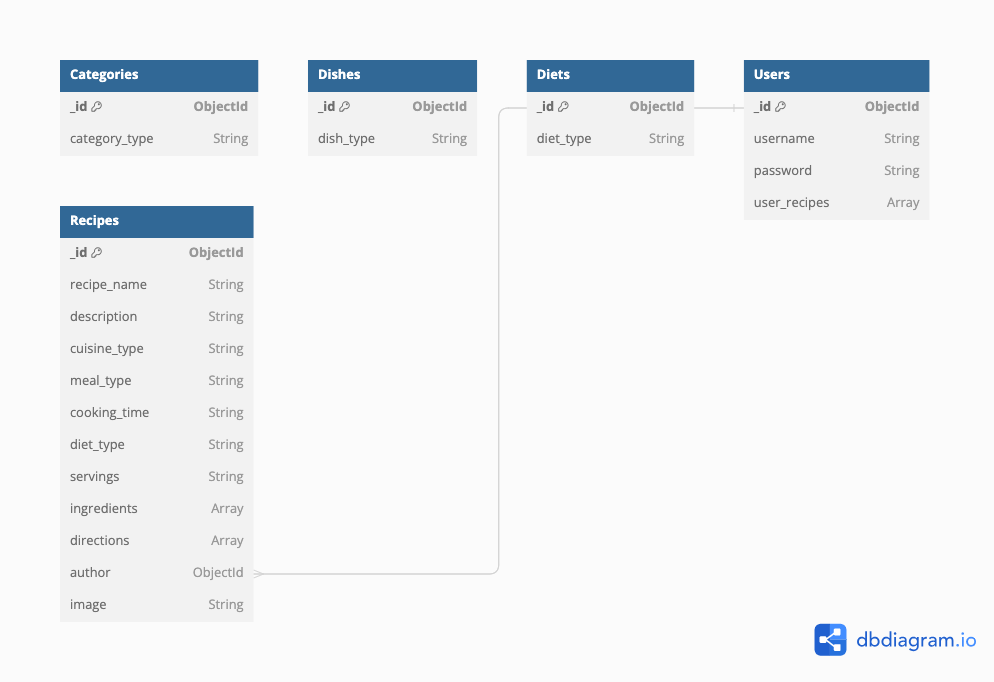

For this project, MongoDB, a NoSQL database, is utilized to store and manage data efficiently. MongoDB's flexibility allows for a schemaless design, meaning each document in a collection does not need to have the same set of fields. Below is an overview of the collections and their respective fields used in this application:

#### Collections and Fields
###### Categories

_id: ObjectId - A unique identifier for each document.
category_type: String - Represents the type of food category.
``````
_id: <ObjectId>
category_type: <String>
``````
##### Dishes

_id: ObjectId - A unique identifier for each dish type.
meal_type: String - Describes the type of dish (e.g.,Christmas, NYE, breakfast, lunch, dinner).
```
_id: <ObjectId>
dish_type: <String>
``````
##### Diets

_id: ObjectId - A unique identifier for each diet type.
diet_type: String - Describes the type of diet (e.g., vegan, gluten free, etc).
```
_id: <ObjectId>
diet_type: <String>
``````

##### Users

_id: ObjectId - A unique identifier for each user.
username: String - The user's chosen username.
password: String - The user's password.
user_recipes: Array - A list of recipe IDs created by the user.
```
_id: <ObjectId>
username: <String>
password: <String>
user_recipes: <Array>
``````

##### Recipes

_id: ObjectId - A unique identifier for each recipe.
recipe_name: String - The name of the recipe.
description: String - A brief description of the recipe.
category_type: String - The type of category the recipe belongs to, referencing the Categories collection.
dish_type: String - The type of meal, referencing the Dishes collection.
cooking_time: String - The time required to prepare and cook the recipe.
diet_type: String - The diet category the recipe falls into, referencing the Diets collection.
servings: String - The number of servings the recipe yields.
ingredients: Array - A list of ingredients required for the recipe.
directions: Array - Step-by-step instructions for preparing the recipe.
author: ObjectId - References the _id of the user who authored the recipe in the Users collection.
image: String - A URL or file path to an image of the finished recipe.
```
_id: <ObjectId>
recipe_name: <String>
description: <String>
category_type: <String>
dish_type: <String>
cooking_time: <String>
diet_type: <String>
servings: <String>
ingredients: <Array>
directions: <Array>
author: <ObjectId>
image: <String>
```
#### Relationships
##### Recipes and Users:
The author field in the Recipes collection is a reference to the _id in the Users collection, indicating which user created the recipe.

Recipes, Categories, Dishes, and Diets: The category_type, dish_type, and diet_type in the Recipes collection serve as references to the Categories, Dishes, and Diets collections, respectively. These fields categorize each recipe but do not enforce strict relational constraints as seen in SQL databases.


- ## Wireframes
Wireframes were created for mobile, tablet and desktop using [Balsamiq](https://balsamiq.com/). Please note some improvements were made during the development of the website.

[Wireframes](documentation/wireframes)


# Features
## Existing Features

The website features a structured layout that includes a Home page, an All Recipes page, an Account Settings page, a Registration page, a Change Password page, a Change Username page, a Login page, a User Recipe page, a Single Recipe page, an Add Recipe page, a Search Recipe page, as well as dedicated 404 and 500 Error pages for navigational and server errors.

All Pages on the website are responsive and have:
- A [favicon](https://www.favicon.cc/) in the browser tab.

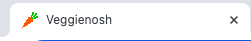

- The Logo: The VeggieNosh logo is strategically positioned at the top of every page for consistent brand visibility. On desktop displays, the logo is placed at the top right, ensuring it's easily noticeable. For smaller screens, the logo is centered to maintain prominence. Clicking the logo from any page redirects users back to the home page, providing a convenient way to return to the start at any time.


- Social Media Icons:
Appearing on every page, the icons are appropriate representations of the Social Media platforms, linking users to the various platforms. The icons appear in the centre of the footer.The footer also carries the copyright notice.


### The Home Page

At the forefront of VeggieNosh, the home page welcomes visitors with a bright, cheerful banner highlighting an assortment of fresh vegetables, framing the site’s purpose in vibrant color. The logo, clear and central, pairs with an engaging tagline that beckons visitors to explore further. Below, the 'Star Veggie Picks' section artfully displays featured recipes, tempting the eye with their vivid imagery. The layout is crisp and user-centric, providing effortless navigation that complements the site’s professional and inviting atmosphere.


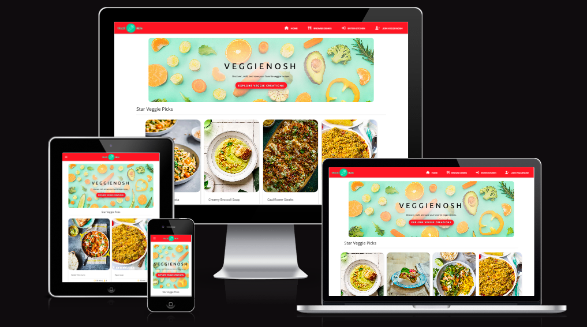

### The Navigation Bar Functionality

The navigation bar is designed for constant presence at the top of the page, ensuring users can effortlessly access different sections of VeggieNosh at any time. 
Adapting to various screen sizes, the navigation collapses into a hamburger icon on tablets and mobile devices, revealing a slide-out menu upon interaction for a clean, uncluttered experience.

Guest users will find the navigation bar includes essential links for seamless browsing:

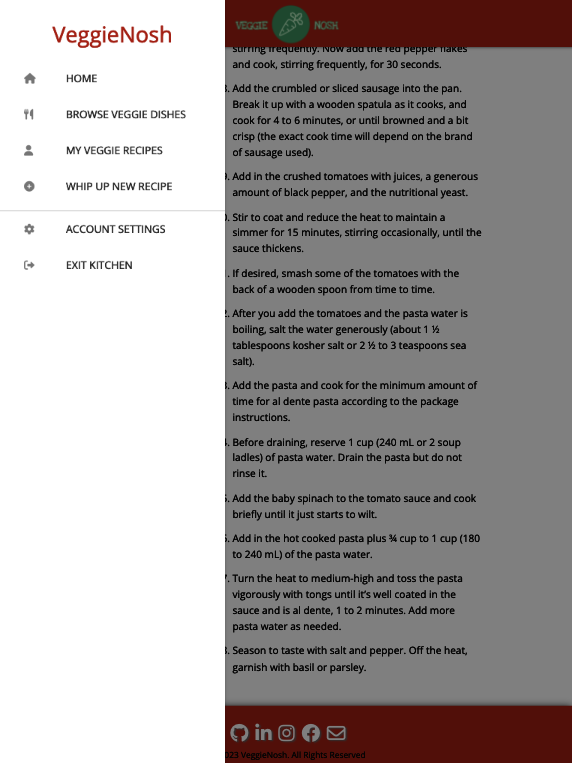

Logged-in users benefit from an expanded set of options, improving their experience with personalized navigation:

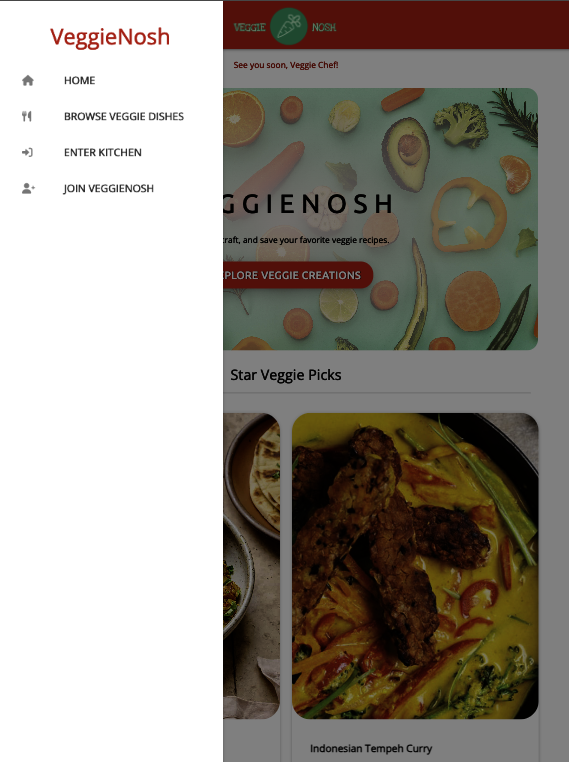

### The All Recipes Page
The 'All Recipes' page of VeggieNosh elegantly presents a collection of recipe cards, organized chronologically from the oldest to the newest additions. Accompanying the page heading is a count of the total recipes available, enclosed within parentheses for easy reference. Each recipe card is interactive and serves as a gateway to a dedicated page, offering detailed information about the recipe. For a streamlined browsing experience, the page is paginated, displaying eight recipes per page for user convenience.

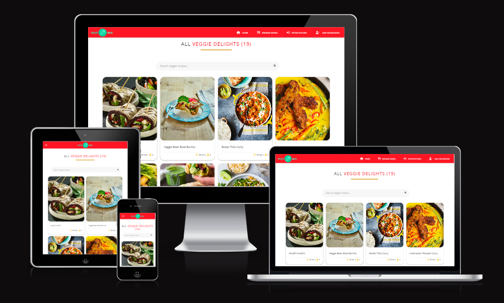

### The Single Recipe Page
Upon selecting a recipe card, the user is directed to the detailed Single Recipe page. This page comprehensively presents all pertinent details of the chosen recipe, including its title, a full description, the category and dish type, dietary categorization, serving size, total cooking time, the author's name, a list of ingredients, step-by-step directions, and a visual representation through a recipe image. In the absence of a user-provided image, a default placeholder image is displayed.

For recipe authors, the page offers additional functionality with 'Edit' and 'Delete' options, allowing for straightforward navigation to the respective editing and deletion functions for their recipes.

Moreover, the Single Recipe page enhances user interaction by providing options to share the recipe on Facebook or WhatsApp, enabling users to easily disseminate their favorite dishes across social platforms. For those who prefer a tangible copy, a 'Print' button is prominently featured, allowing for the recipe to be printed and kept for offline use.

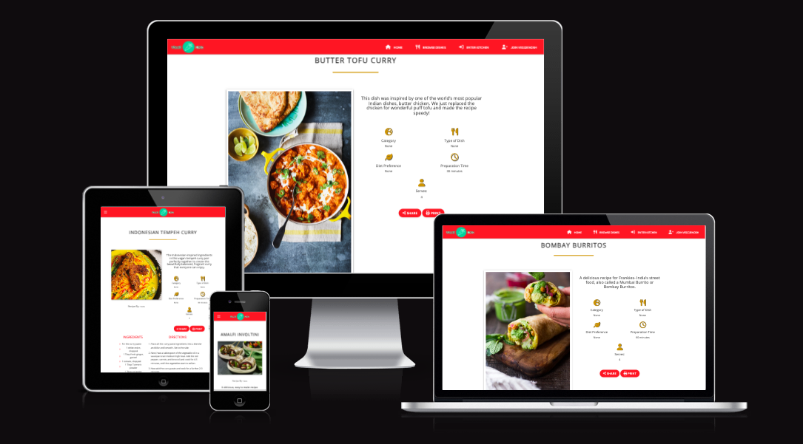

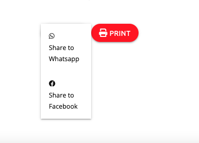

### The Registration Page
The registration page on VeggieNosh is meticulously crafted to ensure user accounts are created with robust security measures. Users are required to provide a "username," "password," and a subsequent "confirm password" entry. Usernames must be distinct, verified for uniqueness, and within a character range of 3-15. Implementing a case-insensitive username check in registration prevents duplicate usernames with different cases, ensuring even more stringent uniqueness. Passwords must be between 6-20 characters in length and adhere to specific security criteria: they must contain at least one letter, one number, and no whitespace. Additionally, passwords cannot be identical to the username and are securely hashed to protect user information.

The system is sensitive to accidental white spaces within entries, alerting users with an error message if any are detected to prevent login complications. If the registration criteria are not met, users receive clear error messages to adjust their input. Following successful registration, the user is directed to the home page with a confirmation notice. A link for existing users to log in is conveniently placed at the bottom of the form for easy access.

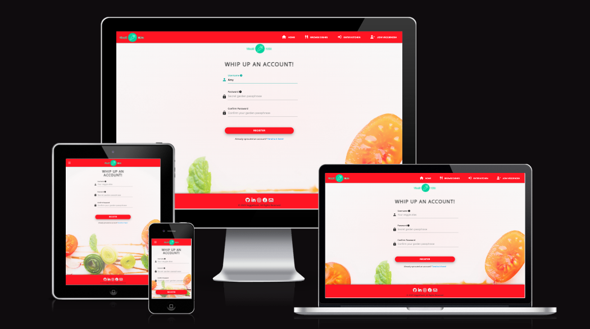

### The Login Page
The login page of VeggieNosh presents a streamlined form with fields for the "username" and "password," facilitating a smooth sign-in process for returning users. Authentication occurs through a verification check where the entered credentials are matched against secured records in the database. Upon successful login, users are seamlessly redirected to the home page with a confirmation message of successful access. Should there be any discrepancies in the input, users are promptly alerted with clear notifications to rectify their login details.

For enhanced security and to prevent login errors, the form is designed to disallow any accidental white spaces in the username and password fields. This measure ensures that user credentials are entered correctly and maintains the integrity of the login process.

Additionally, those new to VeggieNosh will find a convenient link to the registration page below the form, offering an easy transition for users looking to create an account.

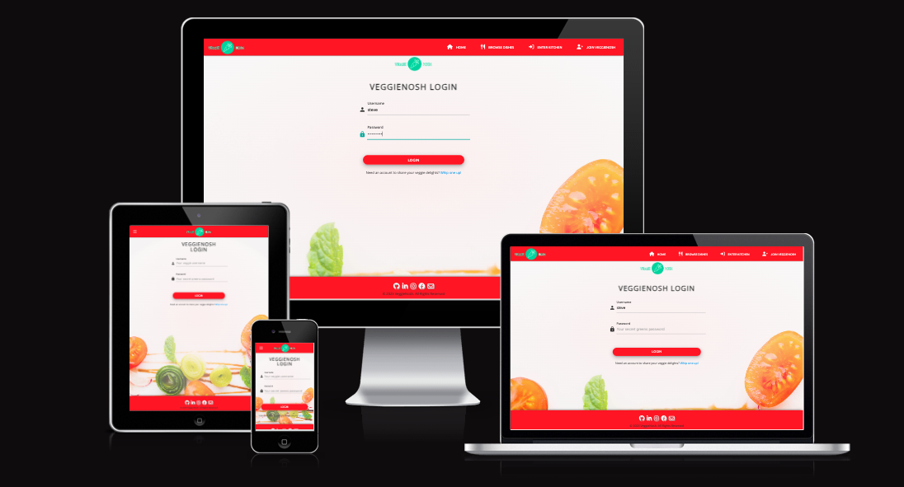

### The Logout Page
For logged-in users, selecting the "Exit Kitchen" button effectively ends their current session. This action will redirect them to the homepage, where they are greeted with a friendly "See you soon, Veggie Chef!" message.

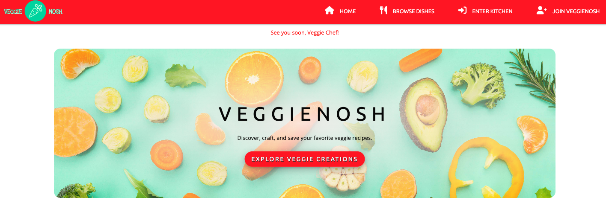

### The Account Settings Page
Within the Account Settings page, users are greeted by their personalized avatar, cleverly generated based on their initials, adding a touch of customization. This is accompanied by a welcoming message and easy access to key account management features. The page provides three intuitive buttons for essential account updates:

- "Spice Up Username" to modify their display name,
- "Refresh Password" to ensure ongoing account security,
- "Shut Kitchen Down" for the option to conclusively deactivate their presence on the site.

These controls are intuitively laid out, guiding users smoothly to the corresponding actions with ease and professionalism.

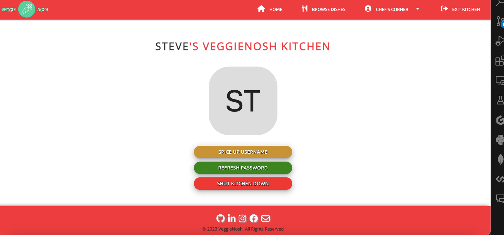

### The Change Username Page
#### Change Username Functionality
The 'Spice Up Username' feature is designed to empower registered users with the ability to update their username while maintaining a high standard of security. The system performs a thorough check to ensure the new username is not already taken, including variations with different capitalizations to prevent impersonation or confusion. Your current username is conveniently displayed above the entry field for easy reference.

Adjacent to the new username field, an informative question mark icon can be found. Hovering over this icon displays the username requirements, assisting users in choosing an acceptable new identifier. Following a successful username change, for enhanced security, users are redirected to the login page to sign in with their new username. Should a user decide against modifying their username, a 'Retreat' button is provided, offering a straightforward return to the Account Settings page without making any changes.

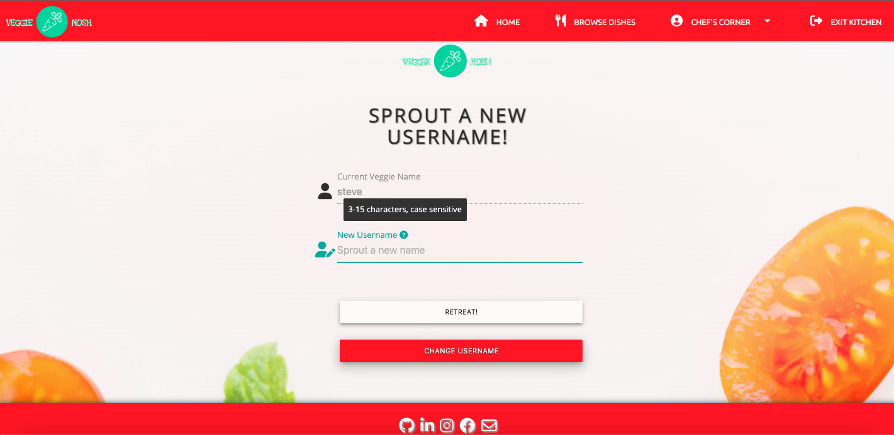

### The Change Password Page
Users have the ability to update their password through a straightforward form, enhancing their account security. The form requires users to input their "Current Password" followed by the "New Password" and a "Confirm New Password" field for verification. To ensure security, both new password entries must be identical, within the length of 6 to 20 characters, and adhere to specific criteria: including at least one letter, one number, and no whitespace.

For additional guidance, a hoverable question mark icon is available, detailing these password requirements. Upon successful submission of the form, the user will be navigated back to the account settings page, where a notification confirming the password update will be displayed. For those who wish to exit without making changes, a "Root Back" button is provided, which will also redirect them back to the account settings page..

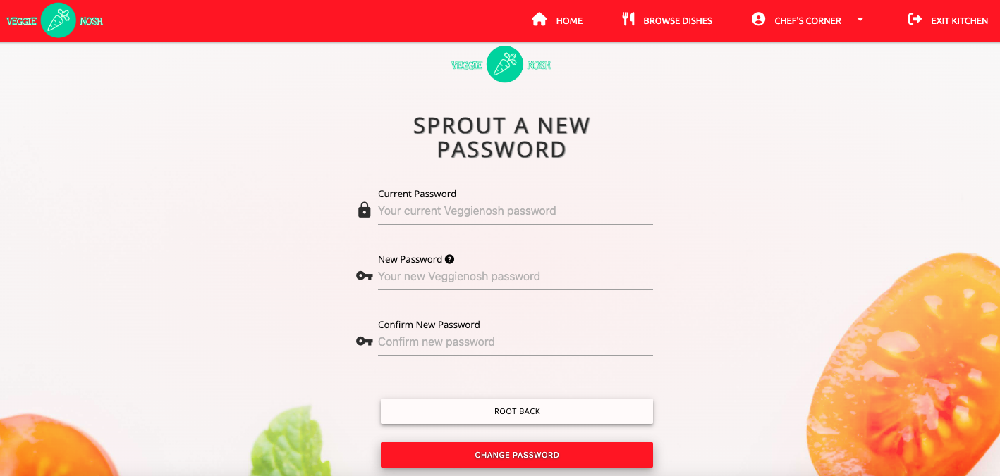

### The Delete Account Page
Upon selecting the "Shut Kitchen Down" option on the account settings page, a confirmation modal will appear, prompting the user to confirm their intention to delete their account. For security purposes, the user is required to enter their password to proceed. By confirming and clicking the "Close Kitchen" button, the user's account will be permanently removed from the "Users" database. Additionally, any recipes created by the user will be concurrently deleted from the "Recipes" collection. Should the user decide to retain their account, they may opt to click the "Back To Kitchen" button, which will close the modal without making any changes.

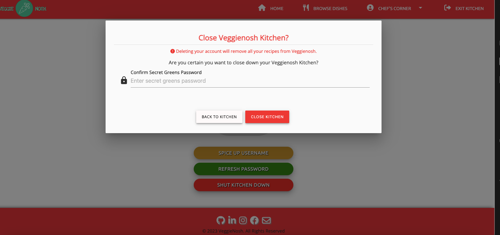

### The User Recipe Page(My Recipe Page)
The "My Recipes" page is a dedicated space for registered users, offering an organized view of all their personal recipes. This feature also conveniently displays the total count of the user's recipes for easy reference. To facilitate the addition of new culinary creations, there is a prominently placed "Add New Veggie Recipe" button which leads users directly to the "Add Recipe" page. For a streamlined browsing experience, the recipes are displayed in a paginated format, showcasing 8 recipes per page. In the event that a user has not yet added any recipes, a friendly prompt encourages them to begin their culinary journey by creating their first recipe.

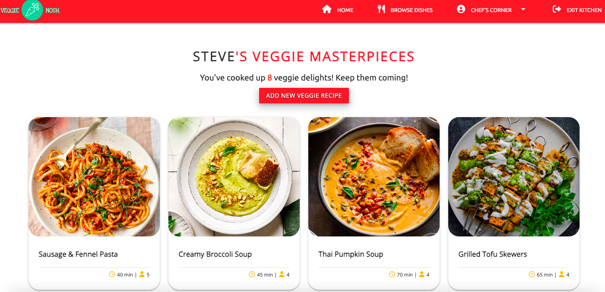

### The Add Recipe Page
For those with registered accounts, VeggieNosh provides a seamless recipe submission experience. Users can contribute new recipes via a submission form, which includes a set of validations to ensure comprehensive and quality entries. Mandatory fields are clearly marked, with 'Recipe category', 'Dish type', and 'Diet type' remaining optional. The 'Recipe Name' and 'Recipe Description' fields have a specified character limit to maintain consistency and readability.

In the event a user does not supply an image URL for the recipe, a default placeholder image is utilized, maintaining a uniform appearance across the platform. A helpful tooltip guides users on uploading images to a free hosting service, like ImgBB, to facilitate image inclusion.

Upon successful submission, the user is immediately taken to the detail page of their newly added recipe, confirming the addition. For added convenience, a 'Change My Mind' button is provided, offering a straightforward return to the User Recipes Page without the need to navigate backward through the browser.

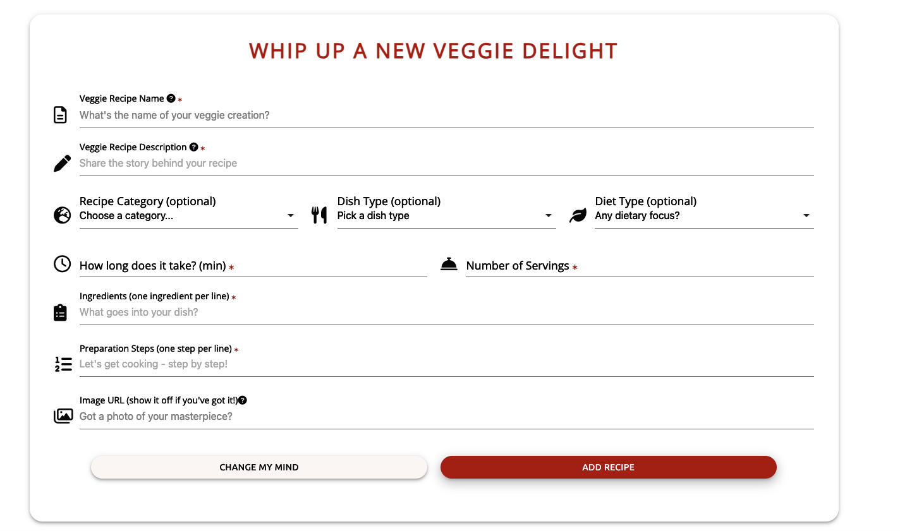

### The Edit Recipe Page
The Edit Recipe page is a feature designed for users who are logged in, enabling them to modify their recipe submissions. This option is exclusively available to the recipe's original author, underscored by the visibility of the "Edit Recipe" button solely on their recipes. To safeguard against unauthorized edits, security measures are in place to ensure only the author can alter the recipe details.

The interface streamlines the editing process by pre-filling the form with the existing recipe information. Upon selecting the "Edit Recipe" button, any changes are immediately saved to the database, and the user is smoothly transitioned to the recipe's info page to review the updated content.

For added convenience, a "Cancel" button is provided, allowing users to return to the home page without the need to navigate backward through their browser, thus enhancing the user experience with a simple alternative.

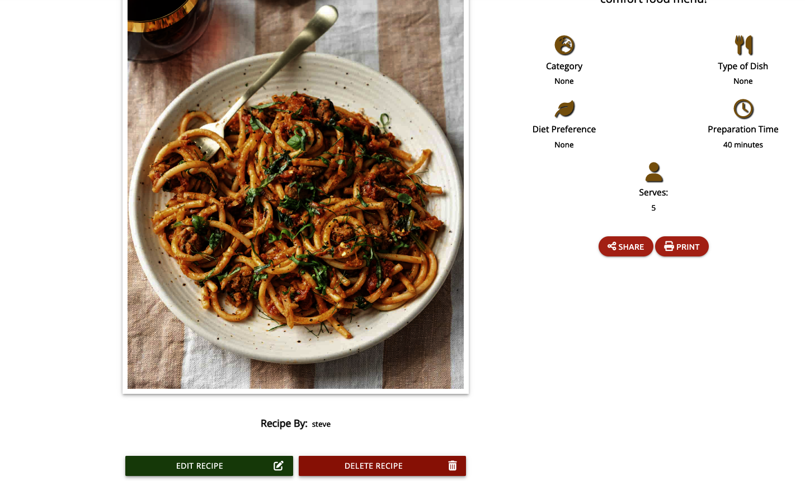
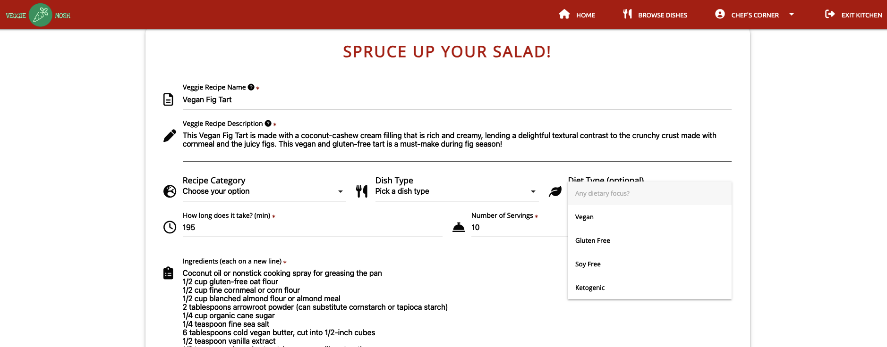
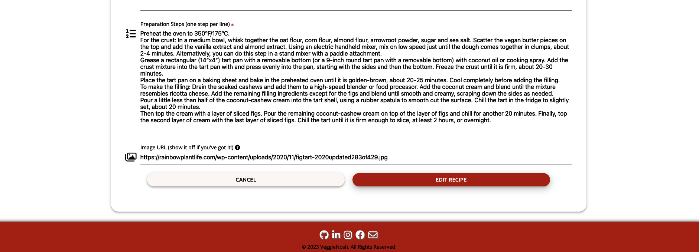

### The Delete Recipe Page
The recipe deletion feature is designed with authorship integrity in mind, ensuring that only the creator of a recipe has the authority to remove it. When visiting a Single Recipe Info page, the author can initiate the deletion process by clicking the "Delete Recipe" button, which triggers a confirmation modal. This modal serves as a safeguard, prompting the user to verify their intention to delete the recipe. Upon confirmation and clicking the "Delete" button within the modal, the recipe is permanently erased from the database and the author’s list of contributions in the "users" collection. For those who reconsider, a "Cancel" button is also available to close the modal without taking any action.

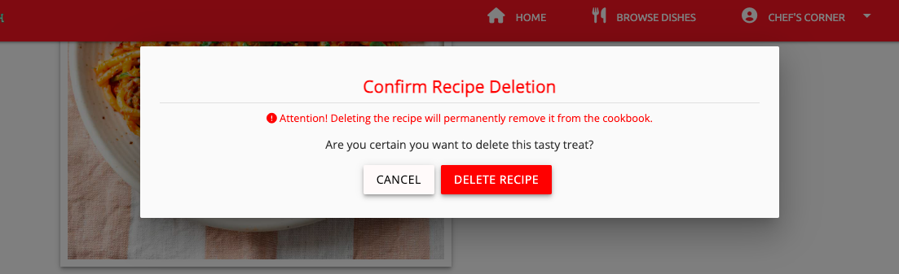

### The Search Page
Central to the page, the search bar allows users to enter their desired recipe or ingredient. It's enhanced with the ability to retain the entered query, even after the search is executed.
To ensure users can find recipes easily, the search functionality employs regex for partial matching. This means even searches with only a few letters, like "am," can yield relevant results.
An intuitive clear button ('×') is included within the search bar, enabling users to effortlessly start a new search by clearing the existing query with a single click.
The page dynamically displays the number of recipes matching the search query. If no results are found, a friendly prompt suggests alternative search terms. Results are presented in a paginated format for easy navigation.

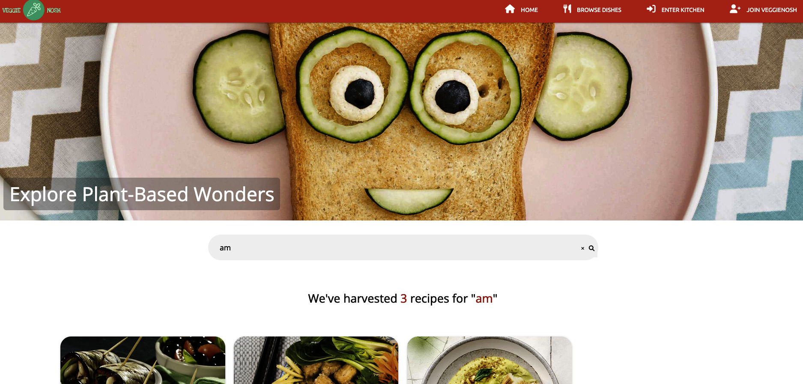
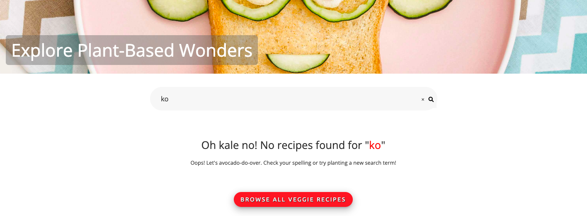

### The 404 and 500 Error Page
Tailored 404 and 500 error pages have been crafted to provide users with clear information about the encountered issue. Each page features a "Return To Veggie Delights" button for a swift return to the homepage. Additionally, the navigation bar is present on these pages, offering an easy route back to any section of the website, should users find themselves off the intended path.
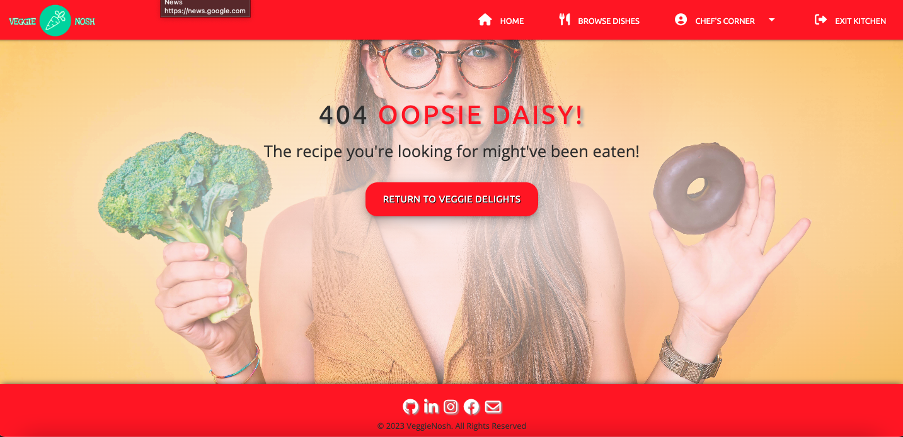


## Features to Implement in the future
In the realm of potential upgrades for the vegan online cookbook application, several features stand out as key to enhancing user experience and functionality. These planned improvements reflect the ongoing commitment to making the application more robust and user-centric. 

* Advanced Recipe Search with Filters: Although a basic search function is already in place, there's room for improvement. The next development phase could introduce advanced filters in the search bar, enabling users to narrow down their searches by criteria like category, dish type, or dietary preferences. This addition would significantly streamline the recipe discovery process.

* Favorites Feature for Personalization: Envisioned as a new aspect of the application, this feature would allow users to 'like' and save their favorite recipes into a personalized 'My Favorites' collection. Each recipe card might include a 'heart' icon, making it easy for users to curate their own list of go-to recipes.

* Pagination Enhancement for Better Navigation: As the number of recipes grows, an upgraded pagination system becomes essential. The proposed system would include intuitive navigation buttons like 'First', 'Last', 'Previous', and 'Next', alongside a display limit for page numbers, ensuring smoother user navigation through the site.

* Forgotten Password Recovery Mechanism: Introducing a feature for password recovery without requiring initial login could significantly enhance user convenience. This typically involves sending a secure link to the user's registered email for password resetting, adding an extra layer of security and user-friendliness to the platform.

* Separate Reviews Page for Clarity: To prevent cluttering recipe pages with extensive reviews, a dedicated review page might be introduced. Displaying a handful of the latest reviews on the recipe page with a link to a full review page could offer a more organized and user-friendly layout.

* Public User Profiles for Community Building: The addition of public user profiles, where users can view all recipes created by a specific user, would foster a sense of community and collaboration. This feature would make user names clickable, leading to a public profile showcasing their culinary creations.

* Direct Image Uploads from Computers: Moving beyond URL-based image uploads, the application could allow users to upload images directly from their devices. This feature would make the process of adding recipes more intuitive and accessible.

* Admin-Focused Category Management Tool: To better manage the expanding database of recipes and categories, a specialized tool for category migration and management could be developed. This would enable admins to efficiently reorganize or update categories, thereby maintaining the application's structure and user experience as it scales.

## Accessibility
Throughout coding this site I kept accessibility in mind, to ensure that the website is user friendly for any user. I did this by:

  * Using semantic HTML.
  * Using descriptive aria labels for all links.
  * Providing information for screen readers when using icons - such as footer icons.


[Back to top](#)


# Issues and Bugs


# Technologies Used

The following technologies were used in the development of the website:

### Main Languages Used
- [HTML5](https://en.wikipedia.org/wiki/HTML5)
- [CSS3](https://en.wikipedia.org/wiki/CSS)
- [JavaScript](https://en.wikipedia.org/wiki/JavaScript) 
- [Python](https://en.wikipedia.org/wiki/Python_(programming_language))

### Frameworks, Libraries & Programs Used
- [Flask](https://flask.palletsprojects.com/en/3.0.x/) microframework for building and rendering pages.
- [MongoDB Atlas](https://www.mongodb.com/) NoSQL database for storing back-end data.
- [PyMongo](https://pypi.org/project/pymongo/) was used as a Python distribution containing tools for working with MongoDB.
- [WTForms](https://pypi.org/project/WTForms/) was used for creating forms with validation.
- [Werkzeug](https://werkzeug.palletsprojects.com/en/2.0.x/utils/#module-werkzeug.security) was used for password hashing and authentication.
- [Jinja](https://jinja.palletsprojects.com/en/3.1.x/) was used as a templating language for Python to display backend data to HTML.
- [Heroku](https://dashboard.heroku.com/apps) was used to deploy the website.
- [Balsamiq](https://balsamiq.com/) was used to create the wireframes during the design phase of the project.
- [GitHub](https://github.com/) was used to store the project after pushing.
- [Google Fonts](https://fonts.google.com/) was used to import the font "Roboto" into the style.css file. This font was used throughout the project.
- [Font Awesome 6.3.0](https://fontawesome.com/) was used on all pages throughout the website to import icons (e.g. social media icons) for UX purposes.
- [jQuery](https://jquery.com/) A JavaScript library.
- [Am I Responsive?](https://ui.dev/amiresponsive) was used in order to see responsive design throughout the process and to generate mockup imagery to be used.
- [Favicon](https://www.favicon.cc/) was used to create a favicon to help users quickly identify a website when multiple tabs are open or when searching through bookmarks.
- [Visual Studio Code](https://code.visualstudio.com/download) was used to create files pages and produce the code for the project.
- [Google Chrome Dev Tools](https://developer.chrome.com/docs/devtools/) was used during the testing phase to test the responsiveness of the site and to check for any bugs.
- [TinyPNG](https://tinypng.com/) was used to compress images.
- [UI Avatars](https://ui-avatars.com/) was used to generate avatars with initials from names.
- [JSON Formatter](https://chrome.google.com/webstore/detail/json-formatter/bcjindcccaagfpapjjmafapmmgkkhgoa) a google chrome extension to enable you to view JSON as raw data or parsed.


# Testing
The website was tested thoroughly to ensure it is fully functional and user-friendly. The testing phase involved manual testing on different devices and browsers.

Testing information can be found in a separate testing [file](TESTING.md).


# Deployment

The project was developed using Visual Studio Code (VSCode) and GitHub Desktop. Changes were committed and pushed to GitHub using GitHub Desktop. The web application is deployed on Heroku because a Python project cannot be hosted on GitHub Pages. The repository itself is hosted on GitHub.

## Deployment to Heroku

There are two ways to deploy on Heroku:
* Using the Heroku Command Line Interface, or
* Connect to GitHub Repository.

I did the second method as it's the simpler way to deploy to Heroku. The steps are as follows.

### 1. Set Up A New Heroku App

  * Navigate to [Heroku.com](https://www.heroku.com/), create a new  account or login if you already have an account.
  * On the dashboard page, click "Create New App" button.
  * Give the app a name, the name must be unique with hypens between words.
  * Set the region closest to you, and click "Create App".

### 2. Create A Requirements.txt file

A requirements.txt file contains a list of the Python dependencies that our project needs to run successfully. It's how Heroku can detect what language we're using. Here are the steps to create a requirements.txt file:

  * Create a requirements.txt file by typing in the terminal:
``````
pipi3 freeze --local > requirements.txt
``````
  * Add, commit, and push the file:
```
git add -A
git commit -m "Add requirements.txt"
git push
``````

### 3. Create A Procfile file

A Procfile is a special kind of file that tells Heroku how to run our project.

  * In the terminal, type:
```
echo web: python run.py > Procfile
``````
This command tells Heroku that it's going to be a web process, and the command to run our application is "python run.py", which is the name of the python file that we've created.
  * Add, commit, and push the file:
```
git add -A
git commit -m "Add Procfile"
git push
``````

### 4. Connect Our App to Github

 * In Heroku app dashboard, navigate to the Deploy page. On the Deployment Method, click "Github".
 * Click on "Connect to Github" button.
 * Fill in the name of your Github repository name and click on "Search".
 * After it found the correct repository, click on "Connect".

### 5. Set Up The Environment Variables in Heroku

Since we've contained our environment variables within a hidden file env.py, Heroku won't be able to read those variables. We can securely tell Heroku which variables are required.

 * Go back to Heroku dashboard of your flask app, navigate to the "Settings" page.
 * Click on "Reveal Config Vars" button, add environment variables in a key-value pairs as below:

| Key          | Value                                             |
|--------------|---------------------------------------------------|
| IP           | 0.0.0.0                                           |
| PORT         | 5000                                              |
| SECRET_KEY   | `<your_secret_key>`                               |
| MONGO_URI    | `mongodb+srv://<username>:<password>@<cluster_name>-ocous.mongodb.net/<database_name>?retryWrites=true&w=majority` |
| MONGO_DBNAME | `<database_name>`                                 |

### 6. Enable The Automatic Deployment

 * On "Automatic Deploys" section, from our master/main branch click on "Enable Automatic Deployment".
 * On "Manual deploy" section, from our master/main click on "Deploy Branch".

 * Heroku will now receive the code from Github and start building the app using our required packages. Once it's done, you'll see a notification "Your app was successfully deployed." The deployed version can now be viewed by selecting View App.

# How To Use This Project

To use this project, follow these steps:

## 1. Create a Database on MongoDB

### 1. Set Up MongoDB

* Navigate to [mongoDB.com](https://www.mongodb.com/), create an account or log in.
* Create a cluster by choosing the Shared Cluster:
    * Select a cloud provider. Amazon Web Service (AWS) is an excellent choice for the project, and then select the region closest to you.
    * Select a cluster tier, choose the M0 Tier (Free forever tier).
    * Click on the cluster name, and fill in the cluster name of your choice.
    * Click "Create Cluster" button. This cluster name will be used in your MONGO_URI environment variable.
*  Navigate to Database Access under the Security section on the left, to create our database user credentials:
    * Click on "Add New Database User", create a username and password. Note to use a combination of letters and numbers for the username and password.
    * Set the "Database User Privileges" to Read and Write to any database, and click "Add User".
    * Click on "Network Access" within the Security menu to whitelist our IP address. Click "Add IP Address", select "Allow Access from Anywhere", click "Confirm".
* Go back to the Cluster tab, click on the Collections tab.
* Create a database according to the Data Scheme:
    * From the Clusters page, click on the Collections button.
    * Click on "Create Database", provide the database name, and one initial collection name.
    * Create more collections by clicking the green button "Create Collection".
    * To manually create a document, click on the "Collection", followed by "Insert Document".

## 2. Fork or Clone The Github Repository

### Fork GitHub Repository

1. Log in to GitHub.
2. Navigate to the main page of the GitHub Repository that you want to fork.
3. At the top right of the Repository just below your profile picture, locate the "Fork" Button.
4. You should now have a copy of the original repository in your GitHub account.
5. Changes made to the forked repository can be merged with the original repository via a pull request.

### Clone Github Repository

1. Log in to GitHub.
2. Navigate to the main page of the GitHub Repository that you want to clone.
3. Above the list of files, click the dropdown called "Code".
4. To clone the repository using HTTPS, under "HTTPS", copy the link.
5. Open Git Bash.
6. Change the current working directory to the location where you want the cloned directory.
7. Type `git clone`, and then paste the URL you copied.
    ```bash
    $ git clone https://github.com/YOUR-USERNAME/YOUR-REPOSITORY
    ```
8. Press Enter. Your local clone will be created.
```
$ git clone https://github.com/YOUR-USERNAME/YOUR-REPOSITORY
> Cloning into `CI-Clone`...
> remote: Counting objects: 10, done.
> remote: Compressing objects: 100% (8/8), done.
> remove: Total 10 (delta 1), reused 10 (delta 1)
> Unpacking objects: 100% (10/10), done.
```
Changes made on the local machine (cloned repository) can be pushed to the upstream repository directly if you have a write access for the repository. Otherwise, the changes made in the cloned repository are first pushed to the forked repository, and then a pull request is created.
## 3. Set Local Environment Variables and Install Dependencies

1. Create a `.gitignore` file in the project's root directory, by typing in the terminal window: `touch .gitignore`
2. Create the environment file, by typing: `touch env.py`
3. Add `env.py` to the `.gitignore` file.
4. Within the `env.py` file, enter the project's environment variables:
    ```python
    import os

    os.environ.setdefault("IP", "0.0.0.0")
    os.environ.setdefault("PORT", "5000")
    os.environ.setdefault("SECRET_KEY", "<your_secret_key>")
    os.environ.setdefault("MONGO_URI", "mongodb+srv://<username>:<password>@<cluster_name>-ocous.mongodb.net/<database_name>?retryWrites=true&w=majority")
    os.environ.setdefault("MONGO_DBNAME", "<database_name>")
    ```
5. Install all dependencies from the requirements file, by typing: `pip3 install -r requirements.txt`.

6. Then, go to the deployment section to configure and deploy the app on Heroku. Skip the create `requirements.txt` and `Procfile` as they're already available in the repo.

[Back to top](#how-to-use-this-project)

# Credits

### Content
All recipe descriptions and images, unless contributed by users, are sourced from [Rainbow PLant Life](https://rainbowplantlife.com/) and [A Couple Cooks](https://www.acouplecooks.com/).

### Media
- All images were sourced by [Freepik](https://www.freepik.com/) free library.
- The favicon was generated from [Favicon](https://www.favicon.cc/).
- The logo was originated from [Hatchful](https://www.shopify.com/tools/logo-maker) and was later refined by the developer.

### Code
During the development of this project, a variety of resources and community support platforms provided essential guidance and assistance. Below is a summary of these key resources:

#### Community Support
- **[Stack Overflow](https://stackoverflow.com/)**, **[W3School](https://www.w3schools.com/)**, **[Geeks for Geeks](https://www.geeksforgeeks.org/)** and **[Medium](https://medium.com/)**: Essential in offering solutions and advice throughout the project's development phase.

#### Documentation and Tutorials
- **Create Flask Application with MongoDB Database [Ankush Chavan](https://ankush-chavan.medium.com/creating-flask-application-with-mongodb-database-77ec45b5b995)**: Primary references for understanding and implementing core functionalities.
- **Flask Tutorials by [Corey Schafer](https://www.youtube.com/watch?v=MwZwr5Tvyxo&list=PL-osiE80TeTs4UjLw5MM6OjgkjFeUxCYH)**: These tutorials covered package structure, custom error pages, WTForms, and password hashing.
- **Flask WTForms Tutorials by [Pretty Printed](https://www.youtube.com/watch?v=eu0tg4vgFr4&list=PLXmMXHVSvS-C_T5JWEDWIc9yEM3Hj52-1)**: Provided clear guidance on using Flask WTForms.

#### Specific Implementations
- **UI & UX Design**: Design concepts were influenced by various projects found on [Awwwards](https://www.awwwards.com/), shaping the user interface and experience.
- **Form Design Elements**: The use of prefix-icons, asterisks, and question-mark tooltips in forms was adapted from Tim Nelson's project.

[Back to top](#top)

# Acknowledgements

I want to express my deepest appreciation to my mentor, Seun, for her steadfast support and invaluable insights throughout this journey. I also thank the CI Slack community for their useful advice and suggestions, and to Jess for her tutoring.

[Back to top](#top)