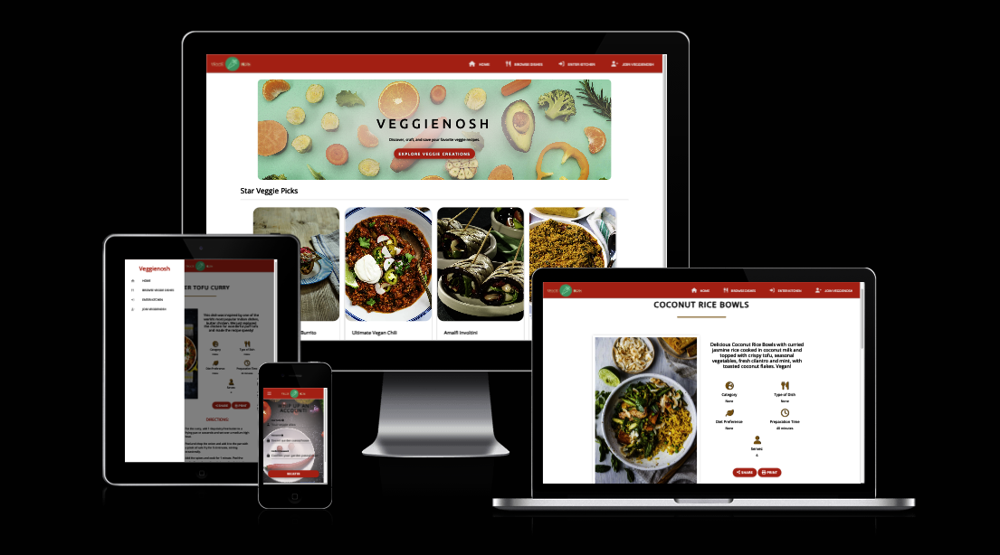
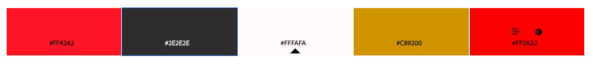

# VEggieNosh

Find the final project here: [VeggieNosh]()

## Table of Contents
- [Introduction](#introduction)
- [UX](#ux)
   * [User Stories](#user-stories)
- [Design](#design)
  * [Technical Framework](#technical-framework)
  * [Colour Scheme](#colour-scheme)
  * [Typography](#typography)
  * [Imagery](#imagery)
  * [Wireframes](#wireframes)
  * [Features](#features)
    * [The Home Page](#the-home-page)
    * 
    * 
    * 
    * [The 404 Error Page](#the-404-error-page)
    * [The 500 Error Page](#the-500-error-page)
    * [Features to Implement in the Future](#features-to-implement-in-the-future)
  * [Accessibility](#accessibility)  
- [Issues and Bugs](#issues-and-bugs)
- [Technologies Used](#technologies-used)
  * [Main Languages Used](#main-languages-used)
  * [Frameworks, Libraries & Programs Used](#frameworks-libraries--programs-used)
- [Testing](#testing)
  * [TESTING.md](#TESTING.md)
- [Deployment](#deployment)
  * [Deploying on GitHub Pages](#deploying-on-github-pages)
  * [Cloning the repository](#cloning-the-repository)
  * [Forking the repository](#forking-the-repository)
- [Credits](#credits)
  * [Content](#content)
  * [Media](#media)
  * [Code](#code)
- [Acknowledgements](#acknowledgements)

## Introduction

### VeggieNosh: A Vegan Recipe-Sharing Platform

**Dedicated to the vibrant world of vegan cuisine**, VeggieNosh is a modern recipe-sharing platform inspired by esteemed websites such as [Vegan Recipe Club](https://veganrecipeclub.org.uk) and [Rainbow Plant Life](https://www.rainbowplantlife.com). Our platform offers a **user-friendly interface** for crafting, sharing, and archiving beloved vegan recipes.

> _This project is a key part of the [Code Institute's Milestone Project 3](https://codeinstitute.net), contributing to the Diploma in Full Stack Software Development. It showcases a proficient implementation of **HTML, CSS, JavaScript, Python+Flask, MongoDB**, and other technologies. VeggieNosh fulfills the essential criteria for **CRUD operations**, allowing users to create, read, update, and delete recipes with ease._

## User Experience
### User Stories

#### New/Unregistered User
- Search for recipes easily.
- Explore all site recipes.
- View complete recipes of interest.
- Intuitive navigation with clear Sign-Up.
- Understand the site's purpose and functionality.

#### Returning/Registered User:
- Quick access to Log In.
- View latest recipes.
- Access account settings, personal cookbook, and other user-specific pages.
- Manage profile and recipes (create, edit, delete).
- Share recipes on social media.
- Print recipes.
- Access a contact page for queries.

#### Administrative User:
- All functionalities of a registered user.
- Manage recipe categories.
- Edit or delete any site recipes.

  
Click to see Persona Forms!

  
  
  

# Design
The architect behind VeggieNosh aimed for a seamless fusion of user-friendliness and modern design principles. This vegan online cookbook is a testament to their commitment to providing an accessible, visually appealing platform where recipes are not only shared but showcased with elegance and clarity.
The following design elements were used in the website:

- ## Technical Framework
The [Materialize](https://materializecss.com/) front-end framework, inspired by Material Design, was the choice for VeggieNosh, bringing a fresh, responsive feel to the table. Together with [JQuery](https://jquery.com/), it lays down the interactive groundwork that makes the navigation and presentation of recipes intuitive and fluid.

- ## Colour Scheme
VeggieNosh embraces a color scheme that draws eyes to the vibrant dishes. A backdrop of white space ensures that the rich colors of the food images pop, complemented by touches of green that echo the essence of fresh, vegan ingredients. The addition of coral energizes and directs users through calls to action, creating an inviting, dynamic experience without overwhelming the visual senses.

Core colors:
- coral (#ff4242): Selected for its lively and inviting quality, encouraging user interaction.
- lightblack (#2e2e2e): Ensures text is readable against the light background.
- mediumwhite (#fffafa) and white (#ffffff): Provide a clean and contemporary canvas for the content.
For account settings, a trio of colors was selected to intuitively guide users through their options:

- Red: For actions that require caution or are irreversible.
- Yellow: For moments where caution is advised or to signal a change.
- Green: For positive actions, confirming correct selections or completion.

## Colour Palette
Using the [Adobe Color](https://color.adobe.com/create/color-wheel) colour wheel

- ## Typography

• The choice of Open Sans as the primary font is deliberate, offering readability and a contemporary ambience, while Ubuntu lends a distinct personality to headings and buttons, enhancing the overall design language.

- ## Imagery
VeggieNosh website primarily relies on a text-based interface to create a distraction-free quiz environment. However, some key images and icons are used:
  * Logo: 

  * Icons: [Font Awesome](https://fontawesome.com/) icons are used to visually communicate functions like social media links and volume control. They are displayed in the website's primary color for consistency.

  * [Favicon](https://www.favicon.cc/): A unique favicon is provided that is representative of the brand identity. It's visible in the browser tab for easy site identification.

## Wireframes
Wireframes were created for mobile, tablet and desktop using [Balsamiq](https://balsamiq.com/). Please note some improvements were made during the development of the website.

[Wireframes](documentation/wireframes)

# Features
## Existing Features

The website is comprised of a home page, a games page, a leaderboard page, a contact form page a 404 error page & a 500 error page.

All Pages on the website are responsive and have:
- A [favicon](https://www.favicon.cc/) in the browser tab.

- The title of the site at the top of every page. This title also acts as a link back to the home page.

- Social Media Icons:
Appearing on every page, the icons are appropriate representations of the Social Media platforms, linking users to the various platforms. The icons appear in the centre of the footer.

- The background image is an essential aspect of the website's visual aesthetic. It contributes to the overall look and feel of the site, giving it a playful and engaging appearance that fits the trivia game theme.

### The Home Page

### The 404 Error Page
The 404 error page displays the sites name as a title. This also acts as a link back to the home page. Within the page there is a sorry message explaining to the user that there has been an error directing them to the page they were looking for. The user can click on Home button or title to redirect themselves to the home page.

### The 500 Error Page
The 500 error page displays the sites names as a title, which also acts as a link back to the home page. Within the page is an error message that tells the user sorry there seems to be an internal server error. The user can click on Home button or title to redirect themselves to the home page.

## Features to Implement in the future
- Additional features that could be added to the website in the future include:
   * 
## Accessibility
Throughout coding this site I kept accessibility in mind, to ensure that the website is user friendly for any user. I did this by:

  * Using semantic HTML.
  * Using descriptive aria labels for all links.
  * Providing information for screen readers when using icons - such as footer icons.

[Back to top](#)

## Issues and Bugs

## Technologies Used

The following technologies were used in the development of the website:

### Main Languages Used
- HTML5
- CSS3
- JS 

### Frameworks, Libraries & Programs Used
- [Bootstrap 5.3.0](https://getbootstrap.com/) 
- [Balsamiq](https://balsamiq.com/) was used to create the wireframes during the design phase of the project.
- [GitHub](https://github.com/) was used to store the project after pushing.
- [Google Fonts](https://fonts.google.com/) was used to import the font "Roboto" into the style.css file. This font was used throughout the project.
- [Font Awesome 6.3.0](https://fontawesome.com/) was used on all pages throughout the website to import icons (e.g. social media icons) for UX purposes.
- [jQuery](https://jquery.com/) A JavaScript library.

- [Am I Responsive?](https://ui.dev/amiresponsive) was used in order to see responsive design throughout the process and to generate mockup imagery to be used.
- [Favicon](https://www.favicon.cc/) was used to create a favicon to help users quickly identify a website when multiple tabs are open or when searching through bookmarks.
- [Visual Studio Code](https://code.visualstudio.com/download) was used to create files pages and produce the code for the project.
- [Google Chrome Dev Tools](https://developer.chrome.com/docs/devtools/) was used during the testing phase to test the responsiveness of the site and to check for any bugs.
- [TinyPNG](https://tinypng.com/) was used to compress images.
- [JSON Formatter](https://chrome.google.com/webstore/detail/json-formatter/bcjindcccaagfpapjjmafapmmgkkhgoa) a google chrome extension to enable you to view JSON as raw data or parsed.

# Testing
The website was tested thoroughly to ensure it is fully functional and user-friendly. The testing phase involved manual testing on different devices and browsers.

Testing information can be found in a separate testing [file](TESTING.md).

## Deployment
The website was deployed on GitHub pages.

### Deploying on GitHub Pages
To deploy the website on GitHub Pages, the following steps were followed:
1. Create a new repository on GitHub
2. Add the necessary files to the repository
3. Go to the settings page of the repository and scroll down to the GitHub Pages section
4. Select the main branch and the root folder, then click save
5. The website will now be live at the URL provided in the GitHub Pages section

### Cloning the repository
You can clone the repository by following these steps:
1. Go to the repository on GitHub.
2. Click the "Code" button to the right of the screen, click HTTPs and copy the link there.
3. Open a GitBash terminal and navigate to the directory where you want to locate the clone.
4. On the command line, type "git clone" then paste in the copied url and press the Enter key to begin the clone process.

### Forking the repository
By forking the GitHub Repository, we make a copy of the original repository on our GitHub account to view and/or make changes without affecting the original owner's repository.
You can fork this repository by using the following steps:
1. Go to the  repository on GitHub.
2. Click on the 'Fork' option towards the top left of the page.
3. Click the dropdown button and click 'create a new fork'.
4. This will bring up a page with details of the repository, fill in boxes as required.
Click 'create fork'.

## Credits
The website was built by the developer. The webpages use images from [Freepik](https://www.freepik.com/), icons from [Font Awesome](https://fontawesome.com/) and [Favicon](https://www.favicon.cc/).

### Content

- Some of the text used in the the various pages were borrowed and adapted from various sites, listed below.

  * 

### Media

- Background imange was sourced by [Freepik](https://www.freepik.com/) free library.
- 

### Code

The developer consulted multiple sites in order to better understand the code they were trying to implement. For code that was copied and edited, the developer made sure to reference this with the code. The following sites were used on a more regular basis:

- [Stack Overflow](https://stackoverflow.com/)
- [W3Schools](https://www.w3schools.com/)
- [Geeks for Geeks](https://www.geeksforgeeks.org/)
- [Medium](https://medium.com/) 

[Back to top](#top)

## Acknowledgements

I want to express my deepest appreciation to my mentor, Seun, for her steadfast support and invaluable insights throughout this journey. I also thank the CI Slack community for their useful advice and suggestions, and to Peter for his tutoring.

[Back to top](#top)

