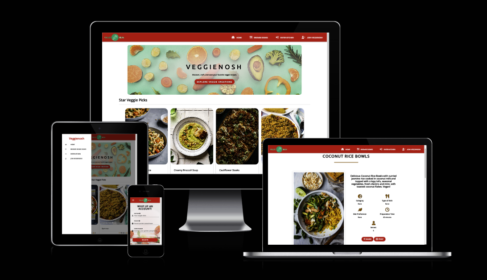

# VeggieNosh - Testing

 
Find the final project here: [VeggieNosh](#)

## Contents
- AUTOMATED TESTING
  - W3C Validator
  - Javascript Validator
  - Python Validator
  - Lighthouse
  - WAVE Testing
- MANUAL TESTING
  - Testing User Stories
  - Full Testing
- BUGS
  - Solved Bugs
  - Known Bugs

Throughout the entire development process, I extensively used Chrome Developer Tools for real-time testing and troubleshooting. I leveraged its console feature to ensure JavaScript code functionality and identify any issues.

To verify adaptability, I employed Google Chrome Developer Tools and Firefox's Inspector tool to check the responsiveness of each page across various devices and screen sizes. This rigorous approach ensured a seamless user experience on multiple platforms.

### AUTOMATED TESTING
#### W3C Validator
[W3C](https://validator.w3.org/) was used to validate the HTML on all pages of the website. It was also used to validate the CSS.
